# 深度学习在量化交易中的应用 - AI 上下文文档

> 更新时间：2025-12-06 09:53:41
> 文档覆盖率：98.0%

## 项目愿景

本项目是一个教育性项目，旨在通过实践代码示例展示如何将深度学习技术应用于现代量化交易策略。项目包含了从基础概念到高级应用的完整教学内容，帮助学习者和研究人员掌握深度学习在金融领域的实际应用。

**作者**: Zihao Zhang
**许可证**: MIT License
**仓库地址**: https://github.com/zcakhaa/Deep-Learning-in-Quantitative-Trading

## 架构总览

项目采用教学驱动的模块化架构，包含7个主要章节，每个章节专注于量化交易中的特定技术领域：

- **第1章**：时间序列基础（项目暂未包含）
- **第2章**：统计分析与时间序列建模
- **第3章**：监督学习与神经网络
- **第4章**：完整的机器学习工作流程
- **第5章**：动量策略与深度学习增强
- **第6章**：风险管理与投资组合优化
- **第7章**：高频交易与限价订单簿

## ✨ 项目结构图

```mermaid
graph TD
    A["(根) 深度学习在量化交易中的应用"] --> B["Chapter2"];
    A --> C["Chapter3"];
    A --> D["Chapter4"];
    A --> E["Chapter5"];
    A --> F["Chapter6"];
    A --> G["Chapter7"];
    A --> H["Data"];
    A --> I["Utilis"];

    B --> B1["统计分析"];
    B --> B2["时间序列模型"];
    B --> B3["波动率聚类"];

    C --> C1["回归与分类"];
    C --> C2["模型训练"];
    C3["5种神经网络架构"] --> C1;
    C3 --> C2;

    D --> D1["完整工作流程"];
    D --> D2["端到端机器学习"];

    E --> E1["时间序列动量"];
    E --> E2["截面动量"];
    E --> E3["深度动量策略"];
    E --> E4["Sharpe比率优化"];

    F --> F1["经典投资组合优化"];
    F --> F2["深度学习投资组合"];
    F --> F3["风险预测"];

    G --> G1["限价订单簿"];
    G --> G2["DeepLOB模型"];
    G --> G3["高频预测"];

    H --> H1["AAPL股票数据"];
    H --> H2["限价订单簿数据"];
    H --> H3["投资组合数据"];

    I --> I1["早停机制"];
    I --> I2["Sharpe损失函数"];
    I --> I3["金融评估指标"];
    I --> I4["数据处理工具"];

    click B "./Chapter2/CLAUDE.md" "查看第2章文档"
    click C "./Chapter3/CLAUDE.md" "查看第3章文档"
    click D "./Chapter4/CLAUDE.md" "查看第4章文档"
    click E "./Chapter5/CLAUDE.md" "查看第5章文档"
    click F "./Chapter6/CLAUDE.md" "查看第6章文档"
    click G "./Chapter7/CLAUDE.md" "查看第7章文档"
    click H "./Data/CLAUDE.md" "查看数据文档"
    click I "./Utilis/CLAUDE.md" "查看工具文档"
```



## 模块索引

| 模块名称 | 路径 | 技术栈 | 模块描述 | 文件数量 | 覆盖率 | 最后更新 |
|---------|------|--------|----------|----------|--------|----------|
| **Chapter2** | `Chapter2/` | Python, pandas, yfinance | 金融时间序列统计分析与建模 | 3个notebook | 100% | 2025-12-06 |
| **Chapter3** | `Chapter3/` | Python, PyTorch, scikit-learn | 监督学习与神经网络基础 | 2个notebook + 5个模型 | 100% | 2025-12-06 |
| **Chapter4** | `Chapter4/` | Python | 完整的机器学习工作流程 | 1个notebook | 100% | 2025-12-06 |
| **Chapter5** | `Chapter5/` | Python, PyTorch | 动量策略与深度学习增强 | 3个notebook + 1个模型 | 100% | 2025-12-06 |
| **Chapter6** | `Chapter6/` | Python, PyTorch | 风险管理与投资组合优化 | 2个notebook + 1个模型 | 100% | 2025-12-06 |
| **Chapter7** | `Chapter7/` | Python, PyTorch | 高频交易与限价订单簿分析 | 2个notebook + 1个模型 | 100% | 2025-12-06 |
| **Data** | `Data/` | CSV | 项目数据集 | 3个数据文件 | 100% | 2025-12-06 |
| **Utilis** | `Utilis/` | Python | 共享工具函数库 | 5个Python文件 | 100% | 2025-12-06 |

## 技术栈

### 核心框架
- **PyTorch**: 深度学习模型构建与训练
- **pandas**: 数据处理与分析
- **numpy**: 数值计算
- **scikit-learn**: 传统机器学习算法
- **matplotlib**: 数据可视化

### 金融数据处理
- **yfinance**: 金融数据获取
- **statsmodels**: 统计模型与时间序列分析
- **scipy**: 科学计算与统计检验

### 开发环境
- **Jupyter Notebook**: 交互式开发环境
- **Python 3.12**: 主要编程语言

## 🚀 核心特性

### 前沿技术集成
- **Transformer**: 自注意力机制处理序列数据
- **WaveNet**: 因果卷积网络
- **DeepLOB**: 专为限价订单簿设计的CNN
- **SharpeRatio优化**: 直接优化风险调整收益

### 教育设计
- **渐进式学习**: 从基础统计到高级深度学习
- **实战导向**: 每个概念都有可运行的代码示例
- **完整工作流**: 从数据获取到模型部署

### 性能指标
- **深度动量策略**: 年化收益2.84%，夏普比率0.76
- **DeepLOB预测**: MSE 0.000287
- **所有模型**: 配备早停机制防止过拟合

## 运行与开发

### 环境设置
```bash
# 克隆项目
git clone https://github.com/zcakhaa/Deep-Learning-in-Quantitative-Trading.git
cd Deep-Learning-in-Quantitative-Trading

# 创建虚拟环境（建议）
python -m venv venv
source venv/bin/activate  # Linux/Mac
# 或
venv\Scripts\activate  # Windows

# 安装依赖（根据各章节的导入安装所需包）
pip install torch pandas numpy scikit-learn matplotlib yfinance statsmodels scipy
```

### 运行方式
1. **本地运行**: 使用Jupyter Notebook或JupyterLab
2. **Google Colab**: 可直接在Colab中运行notebook
3. **VS Code**: 支持Jupyter插件运行

### 数据准备
- AAPL股票数据已包含在`Data/aapl.csv`
- 限价订单簿数据：`Data/limit_order_book_data.csv`
- 投资组合数据：`Data/portfolio_data.csv`

## 测试策略

### 模型评估
- 使用训练/验证/测试集分离（60%/20%/20%）
- 实现早停机制防止过拟合
- 采用多种评估指标（MSE、MAE、Sharpe比率等）

### 回测框架
- 简单的回测函数在`Utilis/metrics.py`
- 支持年化收益率、波动率和夏普比率计算
- 策略性能可视化

## 编码规范

### Python规范
- 遵循PEP 8风格指南
- 使用描述性变量名
- 添加适当的注释

### Jupyter Notebook规范
- 每个notebook包含清晰的章节标题
- Markdown单元格用于说明
- 代码块按逻辑分组

### 项目组织
- 每章独立成文件夹
- 共享代码放在`Utilis`目录
- 模型文件保存在各自的`model`子目录

## AI 使用指引

### 代码生成建议
1. **模型架构**: 可根据需求生成新的神经网络架构
2. **数据预处理**: 可创建新的特征工程技术
3. **评估指标**: 可添加更多金融相关评估指标

### 分析任务
1. **策略回测**: 帮助分析和优化交易策略
2. **风险分析**: 评估模型风险暴露
3. **参数优化**: 协助进行超参数调优

### 扩展方向
1. **新章节**: 可添加新的交易策略章节
2. **强化学习**: 在第7章基础上扩展RL应用
3. **实时交易**: 将策略应用于实时数据
4. **多资产**: 扩展到多资产组合策略

## 📈 项目统计

- **总文件数**: 50个
- **已扫描文件**: 49个
- **覆盖率**: 98.0%
- **Notebook数量**: 13个
- **已训练模型**: 8个
- **工具函数**: 5个
- **数据集**: 3个

## 变更记录 (Changelog)

### 2025-12-06 09:53:41 - 深度扫描更新
- ✨ 深入分析了所有关键notebook内容
- 📊 详细记录了模型架构和性能指标
- 🔍 补充了技术细节和实现方法
- 📈 提升文档覆盖率至98.0%
- 💎 添加了核心特性和性能指标章节
- 🎯 强调了前沿技术的应用（Transformer、WaveNet、DeepLOB）

### 2025-12-06 09:50:23 - 初始创建
- ✨ 创建项目AI上下文文档
- 📊 分析项目结构，识别7个核心模块
- 🔗 建立模块间的导航链接
- 📝 提供开发和使用指南

---

*提示：点击上方模块名称或Mermaid图表中的节点可快速跳转到对应模块的详细文档。*